# 0. cloud和boot的版本关系

**官网信息：[springcloud-overview](https://spring.io/projects/spring-cloud#overview)**

------

**开发工具版本选择：**

1. **cloud: Hoxton.SR1**
2. **boot: 2.2.2.RELEASE**
3. **cloud alibaba: 2.1.0.RELEASE**
4. **java: jdk8**
5. **maven: 3.5及以上**
6. **mysql: 5.7及以上**


# 1. 服务注册中心

**服务注册中心的作用**：

​	在没有使用服务注册中心的情况下，通过使用RestTemplate类的方法也可以实现不同服务模块之间的相互调用，为什么还需要服务注册中心呢？当服务很多时，单靠代码手动管理是很麻烦的，需要一个公共组件统一管理多个服务以及监控服务的运行状态等。

------

## 一、Eureka

PS：Eureka在**2.0时停止更新**（[详情见 Github](https://github.com/Netflix/eureka/wiki#eureka-20-discontinued)）


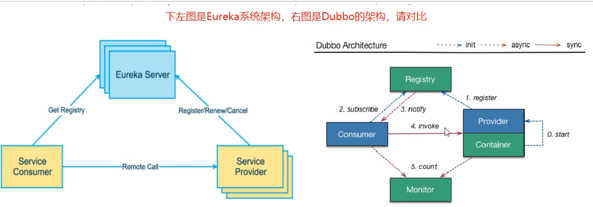

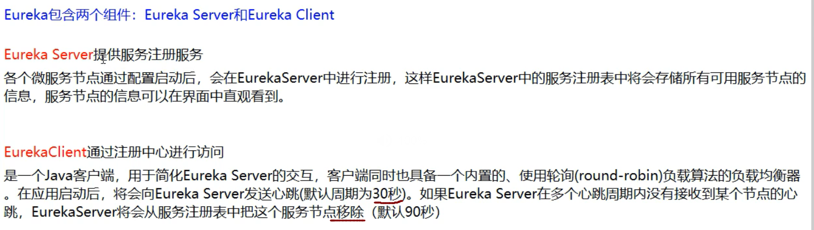

### 1. 单机版Eureka

#### 概念图

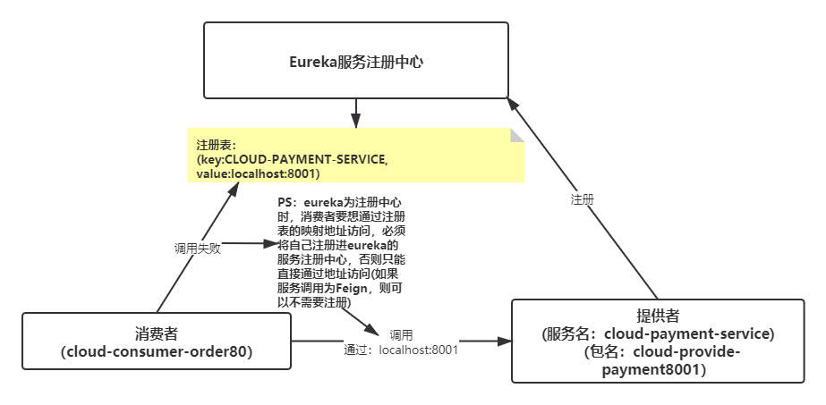

---

#### 搭建Eureka服务注册中心

1. 创建cloud-eureka-server7001模块

2. 加入依赖

  ```xml
  <!-- eureka-server -->
  <dependency>
      <groupId>org.springframework.cloud</groupId>
      <artifactId>spring-cloud-starter-netflix-eureka-server</artifactId>
  </dependency>
  ```

3. 配置application.yml文件

  ```yml
  server:
    port: 7001
  
  eureka:
    instance:
      #eureka服务端的实例名称
      hostname: eureka7001.com
    client:
      #false表示不向注册中心注册自己
      register-with-eureka: false
      #false表示自己端就是注册中心,职责是维护实例,并不需要检索服务
      fetch-registry: false
      service-url:
        #设置与Eureka Server 交互的地址查询服务和注册服务都需要依赖这个地址
        defaultZone: http://${eureka.instance.hostname}:${server.port}/eureka/
  ```

4. SpringBoot启动类上加上**@EnableEurekaServer**注解

5. 测试，访问`localhost:7001`

#### 搭建提供者服务模块

1. 创建cloud-provider-payment8001模块

2. 引入依赖：

  ```xml
  <!--引入eureka客户端-->
  <dependency>
      <groupId>org.springframework.cloud</groupId>
      <artifactId>spring-cloud-starter-netflix-eureka-client</artifactId>
  </dependency>
  ```

3. 配置yml文件中的eureka配置：

  ```yml
  eureka:
    client:
      # 表示是否将自己注册仅EurekaServer，默认true
      register-with-eureka: true
      # 是否从EurekaServer抓取已有的注册信息，默认true。单节点无所谓，集群必须设置true才能配合ribbon使用负载均衡
      fetch-registry: true
      service-url:
        defaultZone: http://localhost:7001/eureka
  ```

4. 创建mapper、service、controller等相关类

  PaymentController部分代码：

  ```java
  /**
   * 通过主键查询单条数据
   *
   * @param id 主键
   * @return 单条数据
   */
  @GetMapping("{id}")
  public CommonResult selectOne(@PathVariable Long id) {
      return success(this.paymentService.getById(id));
  }
  ```

5. ~~启动类上加`@EnableDiscoveryClient`注解~~（PS：该注解可以省略）

6. 测试，访问`localhost:8001/payment/1`，并查看eureka服务注册中心是否存在`CLOUD-PAYMENT-SERVICE`服务

#### 搭建消费者模块

1. 创建cloud-consumer-order80模块

2. 引入依赖：

   ```xml
   <!--引入eureka客户端-->
   <dependency>
       <groupId>org.springframework.cloud</groupId>
       <artifactId>spring-cloud-starter-netflix-eureka-client</artifactId>
   </dependency>
   ```

3. 配置yml：

   ```yml
   # 服务器配置
   server:
     port: 80
   
   spring:
     application:
       name: cloud-order-service
   
   eureka:
     client:
       # 表示是否将自己注册进EurekaServer，默认true
       register-with-eureka: false
       # 是否从EurekaServer抓取已有的注册信息，默认true。单节点无所谓，集群必须设置true才能配合ribbon使用负载均衡
       fetch-registry: false
       service-url:
         defaultZone: http://localhost:7001/eureka
   ```

4. 创建OrderController类：

   ```java
   // 单机模式下请求地址可以写死
   private static final String PAYMENT_URL = "http://localhost:8001";
   
   @GetMapping("/payment/{id}")
   public CommonResult testRest(@PathVariable Long id) {
       CommonResult r = restTemplate.getForObject(PAYMENT_URL + "/payment/" + id, CommonResult.class);
       return r;
   }
   ```

5. 测试，访问`localhost/consumer/payment/1`

### 2. 集群版Eureka

#### 概念图

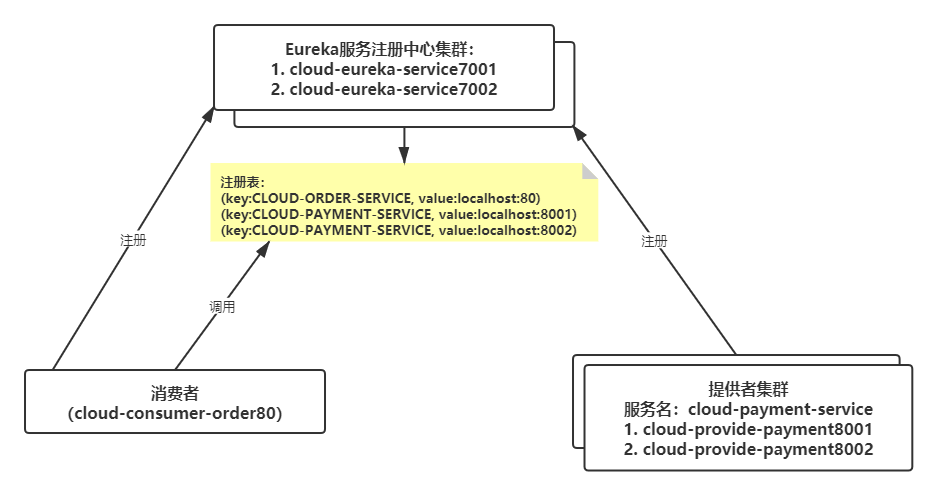

#### 搭建Eureka服务中心集群

1. 同样根据cloud-eureka-service7001创建cloud-eureka-service7002模块

2. 两个模块配置yml文件中的eureka配置：

   ```yml
   eureka:
     instance:
       #eureka服务端的实例名称
       hostname: eureka7001.com
     client:
       #false表示不向注册中心注册自己
       register-with-eureka: false
       #false表示自己端就是注册中心,职责是维护实例,并不需要检索服务
       fetch-registry: false
       service-url:
         #设置与Eureka Server 交互的地址查询服务和注册服务都需要依赖这个地址
   #      defaultZone: http://${eureka.instance.hostname}:${server.port}/eureka/
         # 集群配置，相互守望
         defaultZone: http://eureka7002.com:7002/eureka/
   ```

   

#### 搭建提供者服务集群

1. 根据cloud-provider-payment8001创建cloud-provider-payment8002模块

2. 两个模块的eureka配置

   ```yml
   eureka:
     client:
       # 表示是否将自己注册仅EurekaServer，默认true
       register-with-eureka: true
       # 是否从EurekaServer抓取已有的注册信息，默认true。单节点无所谓，集群必须设置true才能配合ribbon使用负载均衡
       fetch-registry: true
       service-url:
   #      defaultZone: http://localhost:7001/eureka
    	   defaultZone: http://localhost:7001/eureka,http://localhost:7002/eureka
   ```

#### 消费者配置

1. 配置类RestTemplate类上加上`@LoadBalanced` 注解// 使用@LoadBalanced赋予RestTemplate负载均衡的能力

2. OrderController类中使用eureka注册表中的服务名地址：

   ```java
   // 集群模式，实现负载均衡
   private static final String PAYMENT_URL = "http://CLOUD-PAYMENT-SERVICE";
   ```

---

#### 测试

- 启动注册中心集群：
  1.  cloud-eureka-service7001
  2. cloud-eureka-service7002

- 启动提供者集群：
  1. cloud-provider-payment8001
  2. cloud-provider-payment8002

- 启动消费者：

  cloud-consumer-order80

- 访问：`localhost/consumer/payment/1`

测试结果：返回信息中8001和8002轮询，原因Eureka继承了Ribbon，Ribbon在集群模式下，**负载均衡默认为轮询**。

---

***小提醒***：

1. @EnableDiscoveryClient和@EnableEurekaClient共同点就是：都是能够让注册中心能够发现，扫描到改服务。

   不同点：`@EnableEurekaClient`只适用于Eureka作为注册中心，`@EnableDiscoveryClient` 可以是其他注册中心。（如：Zookeeper、Consul等）。

2. 从Spring Cloud Edgware开始，`@EnableDiscoveryClient` 或`@EnableEurekaClient` 可省略。只需加上相关依赖，并进行相应配置，即可将微服务注册到服务发现组件上。

3. `@EnableEurekaServer`不能省略。

---


## 二、Zookeeper

#### 安装zookeeper

虚拟机中使用centos7安装zookeeper：[教程地址](https://zhuanlan.zhihu.com/p/113678809)

#### 搭建提供者服务模块

1. 创建cloud-provider-payment8004模块

2. 部分依赖：

   ```xml
   <!--引入zookeeper客户端-->
   <dependency>
       <groupId>org.springframework.cloud</groupId>
       <artifactId>spring-cloud-starter-zookeeper-discovery</artifactId>
       <!--排除自带的zookeeper 3.5.3-->
       <exclusions>
           <exclusion>
               <groupId>org.apache.zookeeper</groupId>
               <artifactId>zookeeper</artifactId>
           </exclusion>
       </exclusions>
   </dependency>
   <!--添加zookeeper 3.4.14版本,和zookeeper服务器版本一致-->
   <dependency>
       <groupId>org.apache.zookeeper</groupId>
       <artifactId>zookeeper</artifactId>
       <version>3.4.14</version>
   </dependency>
   ```

3. 配置yml

   ```yml
   server:
     port: 8004
   
   spring:
     application:
       name: cloud-provider-payment
     cloud:
       # 注册到zookeeper的地址
       zookeeper:
         connect-string: 192.168.33.128:2181 # 虚拟机ip地址+zookeeper端口号
   ```

4. 创建PaymentController类

   部分代码：

   ```java
   @GetMapping("/zk")
   public String getServerPort() {
       return "springcloud with zookeeper: " + serverPort + " " + IdUtil.randomUUID();
   }
   ```

5. 启动zookeeper和提供者应用，查看zookeeper中注册表服务的变化

#### 消费者模块

1. 创建cloud-consumerzk-order80模块

2. zookeeper依赖同上提供者

3. yml配置：

   ```yml
   server:
     port: 80
   
   spring:
     application:
       name: cloud-consumer-order
     cloud:
       # 注册到zookeeper的地址
       zookeeper:
         connect-string: 192.168.33.128:2181 
   ```

4. 创建OrderController：

   ```java
   public static final String INVOKE_URL = "http://cloud-provider-payment";
   @Resource
   private RestTemplate restTemplate;
   
   @GetMapping("/consumer/payment/zk")
   public String paymentInfo() {
       String result = restTemplate.getForObject(INVOKE_URL + "/payment/zk", String.class);
       return result;
   }
   ```

5. 测试，访问`locahost/consumer/payment/1`

#### 集群版zookeeper

- zookeeper配置集群
- 配置yml文件，将服务注册到多个zookeeper上

---


## 三、Consul


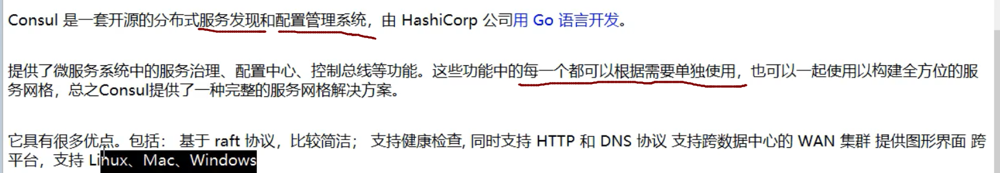

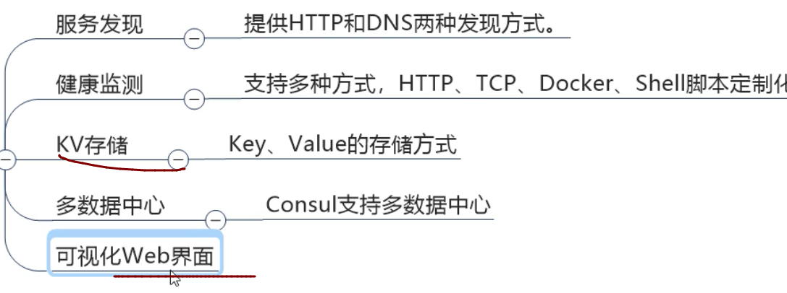

#### 安装consul

[下载地址](https://www.consul.io/downloads)

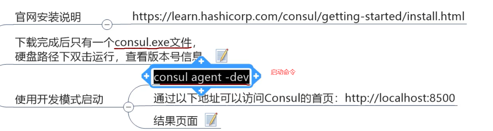

#### 搭建提供者服务模块

1. 创建cloud-providerconsul-payment8006模块

2. 主要依赖：

   ```xml
   <!--spring-cloud consul-server-->
   <dependency>
       <groupId>org.springframework.cloud</groupId>
       <artifactId>spring-cloud-starter-consul-discovery</artifactId>
   </dependency>
   ```

3. 配置yml

   ```yml
   server:
     port: 8006
   
   spring:
     application:
       name: consul-provider-payment
     # consul注册中心地址
     cloud:
       consul:
         host: localhost
         port: 8500
         discovery:
           # hostname: 127.0.0.1
         service-name: ${spring.application.name}
   ```

4. 创建PaymentController类，部分代码

   ```java
   @Value("${server.port}")
   private String serverPort;
   
   @GetMapping("/payment/consul")
   public String getServerPort() {
       return "springcloud with consul: " + serverPort + " " + IdUtil.randomUUID();
   }
   ```

5. 测试，查看`lcoalhost:8005`consul服务注册中心是否有`cloud-payment-service`服务

#### 搭建消费者模块

1. 创建cloud-consumerconsul-order80模块

2. 主要依赖：同上

3. 配置yml

   ```yml
   server:
     port: 80
   
   spring:
     application:
       name: consul-consumer-order
     # consul注册中心地址
     cloud:
       consul:
         host: localhost
         port: 8500
         discovery:
         # hostname: 127.0.0.1
         service-name: ${spring.application.name}
   ```

4. 创建OrderController类，主要代码：

   ```java
   private static final String URL = "http://consul-provider-payment";
   @Resource
   private RestTemplate restTemplate;
   
   @GetMapping("/consumer/payment/consul")
   public String consumerPayment() {
       return restTemplate.getForObject(URL + "/payment/consul", String.class);
   }
   ```

5. 测试，访问`localhost:8500`查看是否注册消费者服务，之后调用`localhost/consumer/payment/consul`

---


## 四、三个服务注册中心的异同

### 经典CAP图

```
C: Consistency(强一致性)
A: Availability(可用性)
P: Partition tolerance(分区容错)
CAP理论关注粒度是数据，而不是整体系统设计的策略

AP(Eureka)
CP(Zookeeper/Consul)
```

- CAP理论的核心是: 一个分布式系统不可能同时很好的满足一致性，可用性和分区容错性这三个需求,
- 最多只能同时较好的满足两个

因此，根据CAP原理将NoSQL数据库分成了满足CA原则、满足CP原则和满足AP原则三大类:

1. CA：单点集群，满足一致性，可用性的系统，通常在可扩展性上不太强大。
2. CP：满足一 致性,分区容忍必的系统，通常性能不是特别高。
3. AP：满足可用性,分区容忍性的系统，通常可能对一 致性要求低一 些。

---


### 异同

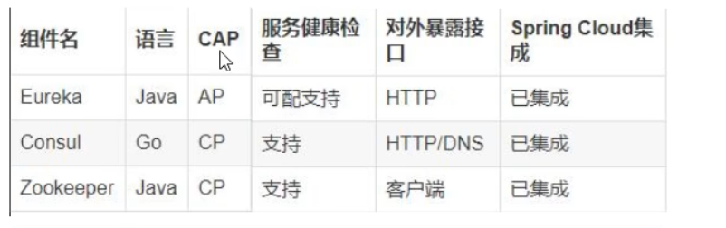


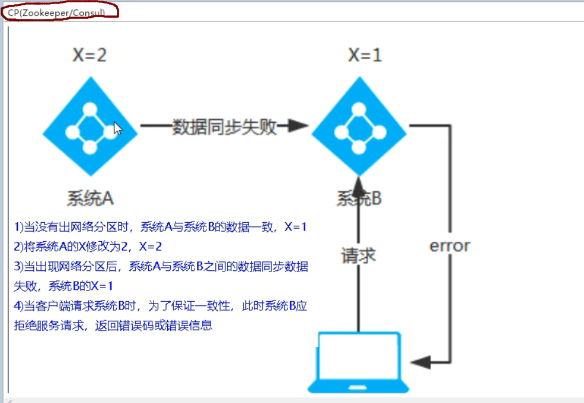

---


# 2. 服务调用

## 一、Ribbon

### Ribbon的负载均衡


***Ribbon目前也进入维护,基本上不准备更新了***

---

### 两种负载均衡

**进程内LB(本地负载均衡)**


**集中式LB(服务端负载均衡)**


**区别：**

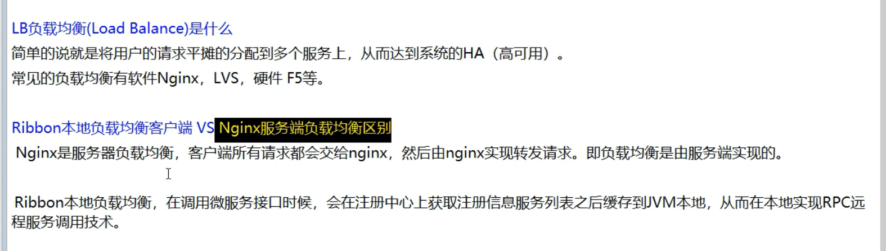

---


### Ribbon就是负载均衡+RestTemplate

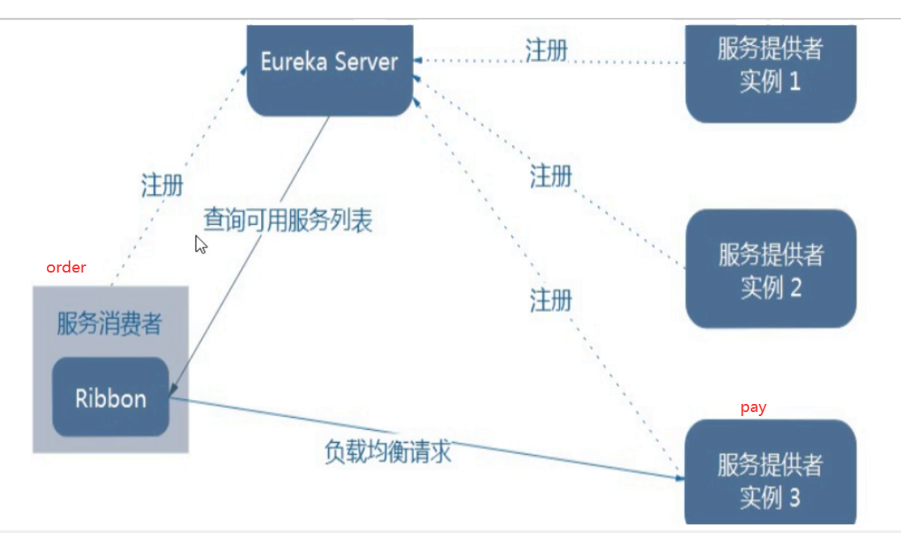


### 使用Ribbon

#### **默认使用eureka的新版本时，它默认继承了ribbon**

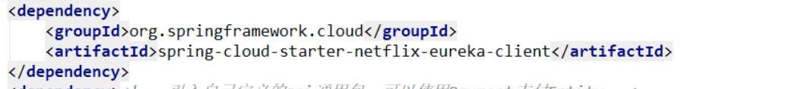


#### **RestTemplate类的用法**

```java
RestTemplate的:
xxxForObject()方法,返回的是响应体中的数据
xxxForEntity()方法.返回的是entity对象,这个对象不仅仅包含响应体数据,还包含响应体信息(状态码等)
```


#### Ribbon常用负载均衡算法

**IRule接口,Riboon使用该接口,根据特定算法从所有服务中,选择一个服务,**

**Rule接口有7个实现类,每个实现类代表一个负载均衡算法**

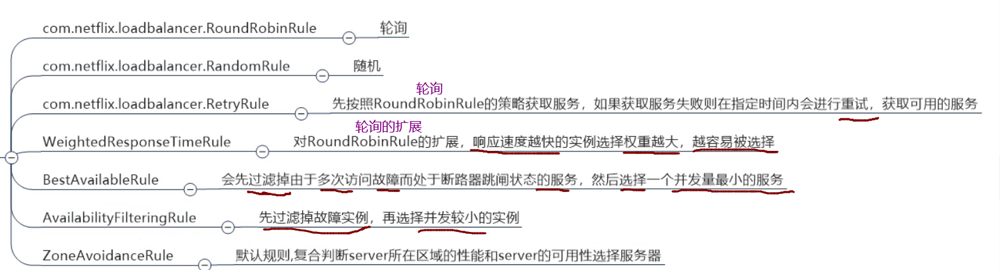


#### 注意事项


#### 修改消费者服务模块

##### 1. 使用Ribbon提供的负载均衡算法

1. 在`cloud-consumer-order80`模块的`com.atguigu`包下新建包：`myrule`

2. 创建配置类，指定负载均衡算法：

   ```java
   public class MySelfRule {
       @Bean
       public IRule myRule() {
           return new RandomRule(); // 随机负载均衡算法
       }
   }
   ```

3. 在启动类上加上注解：

   ```java
   // 指定为name的服务，使用MySeleRule的负载均衡的算法
   @RibbonClient(name = "CLOUD-PAYMENT-SERVICE", configuration = MySelfRule.class)
   ```

4. 测试

##### 2. 使用自定义的负载均衡算法

1. 轮询算法实现原理：

   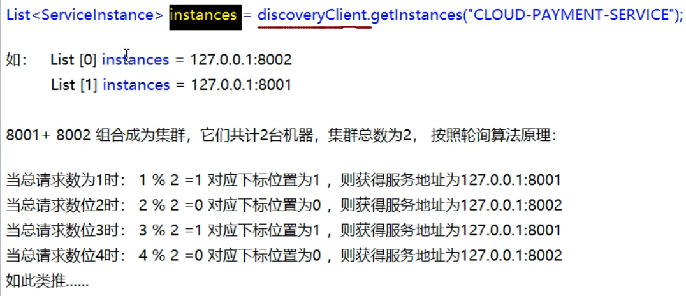

2. 修改cloud-consumerconsul-order80模块：

   去掉RestTemplate类中的`@LoadBalanced`注解，该注解默认使用ribbon的负载均衡

3. 自定义接口(该类放在springcloud的lb包下)：

   ```java
   public interface LoadBalancer {
       ServiceInstance instances(List<ServiceInstance> serviceInstanceList);
   }
   ```

4. 接口实现类(该类放在springcloud的lb包下)：

   ```java
   @Slf4j
   @Component
   public class MyLB implements LoadBalancer {
       private AtomicInteger atomicInteger = new AtomicInteger(0);
   
       public final int getAndIncrement() {
           int current;
           int next;
           // 自旋锁+CAS算法
           do {
               current = atomicInteger.get();
               next = current >= Integer.MAX_VALUE ? 0 : current + 1;
           } while (!atomicInteger.compareAndSet(current, next));
           log.info("-------> 第{}次访问 <---------", next);
           return next;
       }
   
       @Override
       public ServiceInstance instances(List<ServiceInstance> serviceInstanceList) {
           // 轮询服务下标
           int index = getAndIncrement() % serviceInstanceList.size();
           return serviceInstanceList.get(index);
       }
   }
   ```

5. OrderController添加方法：

   ```java
   @GetMapping("/payment/lb")
   public String testMyLB() {
       List<ServiceInstance> instanceList = discoveryClient.getInstances("CLOUD-PAYMENT-SERVICE");
       if (null == instanceList || instanceList.isEmpty()) {
           return null;
       }
       ServiceInstance instance = loadBalancer.instances(instanceList);
       URI uri = instance.getUri();
       return restTemplate.getForObject(uri + "/payment/lb", String.class);
   }
   ```

6. pay(8001,8002)模块添加方法：

   ```java
   @GetMapping("/payment/lb")
   public String testMyLB() {
       return serverPort;
   }
   ```

7. 测试

---


## 二、OpenFeign


### Feign和OpenFeign的区别


### 使用OpenFeign

#### 搭建Feign的消费者

1. 创建`cloud-consumer-feign-order80`模块

2. 主要依赖(由于使用eureka作为服务注册中心，所以消费者需要引入eureka的客户端依赖)：

   ```xml
   <!-- openfeign -->
   <dependency>
       <groupId>org.springframework.cloud</groupId>
       <artifactId>spring-cloud-starter-openfeign</artifactId>
   </dependency>
   <!--引入eureka客户端-->
   <dependency>
       <groupId>org.springframework.cloud</groupId>
       <artifactId>spring-cloud-starter-netflix-eureka-client</artifactId>
   </dependency>
   ```

3. 配置yml

   ```yml
   server:
     port: 80
   
   eureka:
     client:
       register-with-eureka: false # 不注册进Eureka服务注册
       service-url:
         defaultZone: http://eureka7001.com:7001/eureka/,http://eureka7002.com:7002/eureka/
   ```

4. 在启动类上加上`@EnableFeignClients`注解(该注解属于Feign服务调用的注解，与服务注册中心的`@EnableDiscoveryClients`注解不同)，该注解需要配置才能使用Feign的接口。

5. 创建Feign的接口：

   ```java
   @Component
   @FeignClient(value = "CLOUD-PAYMENT-SERVICE")
   public interface PaymentFeignService {
       
       @GetMapping("/payment/{id}")
       CommonResult selectOne(@PathVariable(value = "id") long id); // value = "id" 一定要加
   }
   ```

6. 创建OrderController类：

   ```java
   @Resource
   private PaymentFeignService paymentFeignService;
   
   @GetMapping("/payment/{id}")
   public CommonResult testFeign(@PathVariable long id) {
       return paymentFeignService.selectOne(id);
   }
   ```

7. 测试


### OpenFeign超时机制

OpenFeign默认等待时间是1秒，超过1秒，直接报错

**设置超时时间**

```yml
# 设置feign客户端超时时间（OpenFeign默认支持ribbon）
ribbon:
  # 建立连接所需要的时间，适用于网络状况正常的情况下，两端连接所用的时间（单位ms）
  ConnectTimeout: 5000
  # 建立连接后从服务器读取到可用资源所用的时间（单位ms）
  ReadTimeout: 5000
```


### OpenFeign日志配置

**1. 创建FeignConfig配置类：**

```java
@Configuration
public class FeignConfig {

    @Bean
    Logger.Level feignLoggerLevel() {
        return Logger.Level.FULL;
    }
}
```

**2. 配置yml**

```yml
# 设置feign日志对象及级别
logging:
  level:
    com.atguigu.springcloud.service.PaymentFeignService: debug
```

---


# 3. 服务降级

## 一、Hystrix

### 1. hystrix中的重要概念

**服务降级 `fallback`：**

当某个服务单元发生故障之后,向调用方返回一个符合预期的、可处理的备选响应(FallBack) ，而不是长时间的等待或者抛出调用方无法处理的异常；不让客户端等待并立刻返回一个友好的提示，用来兜底的解决方案。什么时候会发生服务降级呢？程序运行异常、超时、服务熔断触发服务降级、线程池/带宽量满了也会导致服务降级。

**服务熔断`break`：**

类比保险丝达到最大服务访问后，直接拒绝访问，拉闸限电，然后调用服务降级的方法并返回友好提示。处理流程是`服务的降级->进而熔断->恢复调用链路`

**服务限流 `flowlimit`：**

秒杀高并发等操作，流量请求突然变多的时候，严禁一窝蜂的过来拥挤，大家排队，一秒钟N个，要么排队有序进行处理这些请求，要么友好提示立即返回，这样保证服务正常,限制⼀次只可以有多少请求,不让服务挂了。

### 2. hystrix的使用

#### 使用hystrix实现服务降级

##### 搭建提供者模块

1. 创建`cloud-provider-hystrix-payment8001`模块

2. 主要依赖：

   ```xml
   <!-- hystrix-->
   <dependency>
       <groupId>org.springframework.cloud</groupId>
       <artifactId>spring-cloud-starter-netflix-hystrix</artifactId>
   </dependency>
   <!--eureka client-->
   <dependency>
       <groupId>org.springframework.cloud</groupId>
       <artifactId>spring-cloud-starter-netflix-eureka-client</artifactId>
   </dependency>
   ```

3. 配置yml：

   ```yml
   server:
     port: 8001
   
   spring:
     application:
       name: cloud-provider-hystrix-payment
   
   eureka:
     client:
       register-with-eureka: true
       fetch-registry: true
       service-url:
         defaultZone: http://localhost:7001/eureka
   ```

4. 启动类加上注解：`@EnableCircuitBreaker`或`@EnableHystrix`

5. 创建PaymetService类，主要代码：

   ```java
   public String paymentInfo_OK(Integer id) {
       return "线程：" + Thread.currentThread().getName() + " paymentInfo_OK, id: " + id + "O(∩_∩)O哈哈~";
   }
   
   /**
    * hystrix配置服务降级
    * 设置3s(hystrix默认1s)内服务没有响应或出现异常，则执行回调方法：`paymentInfo_TimeoutHandler`
    * 注：回调方法除名字不同以外，其他的参数返回值类型保持一致
    *
    * @param id
    * @return java.lang.String
    */
   @HystrixCommand(fallbackMethod = "paymentInfo_TimeoutHandler", commandProperties = {
           @HystrixProperty(name = "execution.isolation.thread.timeoutInMilliseconds", value = "5000")
   })
   public String paymentInfo_Timeout(Integer id) {
       // 1. 出现异常情况
       // int i = 10 / 0;
       // 2. 响应超时情况
       int timeout = 3000;
       try { TimeUnit.MILLISECONDS.sleep(timeout); } catch (InterruptedException e) { e.printStackTrace(); }
       return "线程：" + Thread.currentThread().getName() + " paymentInfo_TimeOut, id: " + id + "O(∩_∩)O哈哈~ + 耗时(毫秒)" + timeout;
   }
   
   public String paymentInfo_TimeoutHandler(Integer id) {
       return "线程：" + Thread.currentThread().getName() + " 系统繁忙或出现异常, id: " + id + " o(╥﹏╥)o";
   }
   ```

6. 创建PaymentController类，主要代码：

   ```java
   @Resource
   private PaymentService paymentService;
   
   @GetMapping("/payment/hystrix/ok/{id}")
   public String paymentInfo_OK(@PathVariable("id") Integer id) {
       String result = paymentService.paymentInfo_OK(id);
       log.info("------------result: " + result);
       return result;
   }
   
   @GetMapping("/payment/hystrix/timeout/{id}")
   public String paymentInfo_Timeout(@PathVariable("id") Integer id) {
       String result = paymentService.paymentInfo_Timeout(id);
       log.info("------------result: " + result);
       return result;
   }
   ```

##### 搭建消费者模块

1. 创建`cloud-consumer-feign-hystrix-order80`模块

2. 主要依赖：

   ```xml
   <!-- openfeign -->
   <dependency>
       <groupId>org.springframework.cloud</groupId>
       <artifactId>spring-cloud-starter-openfeign</artifactId>
   </dependency>
   <!-- hystrix-->
   <dependency>
       <groupId>org.springframework.cloud</groupId>
       <artifactId>spring-cloud-starter-netflix-hystrix</artifactId>
   </dependency>
   <!--eureka client-->
   <dependency>
       <groupId>org.springframework.cloud</groupId>
       <artifactId>spring-cloud-starter-netflix-eureka-client</artifactId>
   </dependency>
   ```

3. 配置yml：

   ```yml
   server:
     port: 80
   
   eureka:
     client:
       register-with-eureka: false
       service-url:
         defaultZone: http://localhost:7001/eureka
   
   # 配置feign启用hystrix，默认不启用
   # 启用后，会将@FeignClient标记的那个service接口下所有的方法进行了hystrix包装（类似于在这些方法上加了一个@HystrixCommand），
   # 这些方法会应用一个默认为1s的超时时间，controller上3秒超时时间就没有效果了
   #feign:
   #  hystrix:
   #    enabled: true
   
   # 设置ribbon的请求连接时间和请求超时时间
   ribbon:
     ConnectTimeout: 5000 # 请求连接的超时时间
     ReadTimeout: 5000 # 请求处理的超时时间
   ```

4. 启动类上加上：

   ```java
   @EnableFeignClients
   @EnableHystrix
   ```

5. 创建FeignService和OrderController类，OrderController主要代码：

   ```java
   @Resource
   private FeignService feignService;
   
   @GetMapping("/consumer/payment/hystrix/ok/{id}")
   public String ok(@PathVariable("id") Integer id) {
       return feignService.paymentInfo_OK(id);
   }
   
   @HystrixCommand(fallbackMethod = "paymentInfo_TimeoutHandler", commandProperties = {
           @HystrixProperty(name = "execution.isolation.thread.timeoutInMilliseconds", value = "5000")
   })
   @GetMapping("/consumer/payment/hystrix/timeout/{id}")
   public String timeout(@PathVariable("id") Integer id) {
       return feignService.paymentInfo_Timeout(id);
   }
   
   public String paymentInfo_TimeoutHandler(Integer id) {
       return "我是消费者80，对方支付系统繁忙请10秒钟后再试或者自己运行出错请检查自己，o(╥﹏╥)o";
   }
   ```

6. 测试

##### 解决重复代码问题

**当处理的服务降级较多而且回调方法类似时，可以通过配置全局服务降级回调方法**

1. 首先在类上加上注解

   ```java
   // 指定全局服务降级处理
   @DefaultProperties(defaultFallback = "payment_Global_FallbackMethod")
   ```

2. 配置服务降级处理

   ```java
   @HystrixCommand // 没有指定服务降级备用方法时，使用默认全局配置
   @GetMapping("/consumer/payment/hystrix/timeout/{id}")
   public String timeout(@PathVariable("id") Integer id) {
       return feignService.paymentInfo_Timeout(id);
   }
   
   /* 全局服务降级处理 */
   public String payment_Global_FallbackMethod() {
       return "Global异常处理信息，请稍后再试，o(╥﹏╥)o";
   }
   ```

##### 解决代码耦合度高的问题

**业务方法和备用方法混在同一个类中，代码耦合度高，不利于维护**

**解决方案：通过feign的`@FeignClient`注解的fallback属性，配置一个专门有备用方法的类(该类必须实现feign的服务类)**

1. 配置yml：

   ```yml
   feign:
     hystrix:
       enabled: true # feign启用服务降级
   ```

2. PaymentHystrixService配置注解(fallback属性指定PaymentFallbackService类)：

   ```java
   @FeignClient(value = "CLOUD-PROVIDER-HYSTRIX-PAYMENT", fallback = PaymentFallbackService.class)
   ```

3. 创建PaymentFallbackService类：

   ```java
   @Component
   public class PaymentFallbackService implements PaymentHystrixService {
   
       @Override
       public String paymentInfo_OK(Integer id) {
           return "-------PaymentFallbackService fall back-[paymentInfo_OK],o(╥﹏╥)o";
       }
   
       @Override
       public String paymentInfo_Timeout(Integer id) {
           return "-------PaymentFallbackService fall back-[paymentInfo_Timeout],o(╥﹏╥)o";
       }
   }
   ```

4. 测试

#### 使用hystrix实现服务熔断

1. 修改PaymentHystrixService类，

   添加服务熔断的方法示例：

   ```java
   //=========================== 服务熔断 ===========================
   
   /**
    * 服务的降级->进而熔断->恢复调用链路
    */
   @HystrixCommand(fallbackMethod = "paymentCircuitBreaker_fallback", commandProperties = {
           @HystrixProperty(name = "circuitBreaker.enabled", value = "true"), //是否开启断路器
           @HystrixProperty(name = "circuitBreaker.requestVolumeThreshold", value = "10"), //请求次数
           @HystrixProperty(name = "circuitBreaker.sleepWindowInMilliseconds", value = "10000"), //时间窗口期
           @HystrixProperty(name = "circuitBreaker.errorThresholdPercentage", value = "60"),//失败率达到多少后跳闸
   })
   public String paymentCircuitBreaker(@PathVariable("id") Integer id) {
       if (id < 0) {
           throw new RuntimeException("******id 不能为负数");
       }
       String serialNumber = IdUtil.simpleUUID();
       return Thread.currentThread().getName() + " 调用成功，流水号：" + serialNumber;
   }
   
   public String paymentCircuitBreaker_fallback(@PathVariable("id") Integer id) {
       return "id 不能负数，请稍后再试，o(╥﹏╥)o id：" + id;
   }
   ```

2. 在PaymentHystrixController类中添加方法：

   ```java
   //=========================== 服务熔断 ===========================
   
   @GetMapping("/payment/circuit/{id}")
   public String paymentCircuitBreaker(@PathVariable("id") Integer id) {
       String result = paymentService.paymentCircuitBreaker(id);
       log.info("------------result: " + result);
       return result;
   }
   ```

3. 启动服务测试，多次以负数参数访问该接口

##### 总结

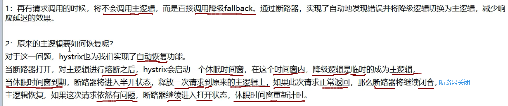

**其他配置：**

```java
@HystrixCommand(fallbackMethod = "xxx_method",
groupKey = "strGroupCommand",
commandKey = "strCommarld",
threadPoolKey = "strThreadPool",
commandProperties = {
        //设置隔离策略，THREAD 表示线程她SEMAPHORE:信号他隔离
        @HystrixProperty(name = "execution.isolation.strategy", value = "THREAD"),
        //当隔离策略选择信号他隔离的时候，用来设置信号地的大小(最大并发数)
        @HystrixProperty(name = "execution.isolation.semaphore.maxConcurrentRequests", value = "10"),
        //配置命令执行的超时时间
        @HystrixProperty(name = "execution.isolation.thread.timeoutinMilliseconds", value = "10"),
        //是否启用超时时间
        @HystrixProperty(name = "execution.timeout.enabled", value = "true"),
        //执行超时的时候是否中断
        @HystrixProperty(name = "execution.isolation.thread.interruptOnTimeout", value = "true"),
        //执行被取消的时候是否中断
        @HystrixProperty(name = "execution.isolation.thread.interruptOnCancel", value = "true"),
        //允许回调方法执行的最大并发数
        @HystrixProperty(name = "fallback.isolation.semaphore.maxConcurrentRequests", value = "10"),
        //服务降级是否启用，是否执行回调函数
        @HystrixProperty(name = "fallback.enabled", value = "true"),
        @HystrixProperty(name = "circuitBreaker.enabled", value = "true"),
        //该属性用来设置在滚动时间窗中，断路器熔断的最小请求数。例如，默认该值为20的时候，
        //如果滚动时间窗(默认10秒)内仅收到了19个请求，即使这19个请求都失败了， 断路器也不会打开。
        @HystrixProperty(name = "circuitBreaker.requestVolumeThreshold", value = "20"),
        // 该属性用来设置在熔动时间窗中表示在滚动时间窗中，在请求数量超过
        // circuitBreaker.requestVolumeThreshold 的情况下,如果错误请求数的百分比超过50,
        //就把断路器设置为“打开”状态，否则就设置为“关闭”状态。
        @HystrixProperty(name = "circuitBreaker.errorThresholdPercentage", value = "50"),
        // 该属性用来设置当断路器打开之后的休眠时间窗。休眠时间窗结束之后,
        //会将断路器置为"半开”状态，尝试熔断的请求命令，如果低然失败就将断路器继续设置为"打开”状态，
        //如果成功就设置为"关闭”状态。
        @HystrixProperty(name = "circuitBreaker.sleepWindowinMilliseconds", value = "5009"),
        //断路器强制打开
        @HystrixProperty(name = "circuitBreaker.force0pen", value = "false"),
        // 断路器强制关闭
        @HystrixProperty(name = "circuitBreaker.forceClosed", value = "false"),
        //滚动时间窗设置，该时间用于断路器判断健康度时需要收集信息的持续时间
        @HystrixProperty(name = "metrics.rollingStats.timeinMilliseconds", value = "10000"),
        //该属性用来设置滚动时间窗统计指标信息时划分”桶"的数量，断路器在收集指标信息的时候会根据设置的时间窗长度拆分成多个"相"来累计各度量值，每个”桶"记录了-段时间内的采集指标。
        //比如10秒内拆分成10个”桶"收集这样，所以timeinMilliseconds 必须能被numBuckets 整除。否则会抛异常
        @HystrixProperty(name = "metrics.rollingStats.numBuckets", value = "10"),
        //该属性用来设置对命令执行的延迟是否使用百分位数来跟踪和计算。如果设置为false,那么所有的概要统计都将返回-1.
        @HystrixProperty(name = "metrics .rollingPercentile.enabled", value = "false"),
        //该属性用来设置百分位统计的滚动窗口的持续时间， 单位为毫秒。
        @HystrixProperty(name = "metrics.rollingPercentile.timeInMilliseconds", value = "60000"),
        //该属性用来设置百分位统计演动窗口中使用“桶”的数量。
        @HystrixProperty(name = "metrics.rollingPercentile.numBuckets", value = "60000"),
        // 该属性用来设置在执行过程中每个 “桶”中保留的最大执行次数。如果在滚动时间窗内发生超过该设定值的执行次数，就从最初的位置开始重写。例如，将该值设置为100,燎动窗口为10秒， 若在10秒内一 一个“桶 ” 中发生7500次执行，
        //那么该“桶”中只保留最后的100次执行的统计。另外,增加该值的大小将会增加内存量的消耗， 并增加排序百分位数所需的计算
        @HystrixProperty(name = "metrics.rollingPercentile.bucketSize", value = "100"),
        //该属性用来设置采集影响断路器状态的健康快照(请求的成功、错误百分比) 的间隔等待时间。
        @HystrixProperty(name = "metrics.healthSnapshot.intervalinMilliseconds", value = "500"),
        //是否开启请求缓存
        @HystrixProperty(name = "requestCache.enabled", value = "true"),
        // HystrixCommand的执行和时间是否打印日志到HystrixRequestLog中
        @HystrixProperty(name = "requestLog.enabled", value = "true"),
},
threadPoolProperties = {
        //该参数用来设置执行命令线程他的核心线程数，该值 也就是命令执行的最大并发量
        @HystrixProperty(name = "coreSize", value = "10"),
        //该参数用来设置线程她的最大队列大小。当设置为-1时，线程池将使用SynchronousQueue 实现的队列，
        // 否则将使用LinkedBlocakingQueue实现队列
        @HystrixProperty(name = "maxQueueSize", value = "-1"),
        // 该参数用来为队列设置拒绝阀值。 通过该参数， 即使队列没有达到最大值也能拒绝请求。
        //該参数主要是対linkedBlockingQueue 队列的朴充,因为linkedBlockingQueue
        //队列不能动态修改它的对象大小，而通过该属性就可以调整拒绝请求的队列大小了。
        @HystrixProperty(name = "queueSizeRejectionThreshold", value = "5"),
}
```

---

#### 使用hystrixdashboard监控

1. 创建`cloud-consumer-hystrix-dashboard9001`模块

2. 主要依赖：

   ```xml
   <dependency>
       <groupId>org.springframework.cloud</groupId>
       <artifactId>spring-cloud-starter-netflix-hystrix-dashboard</artifactId>
   </dependency>
   ```

3. 配置yml：

   ```yml
   server:
     port: 9001
   ```

4. 在启动类上添加`@EnableHystrixDashboard`注解

5. 启动访问：`localhost:9001/hystrix`

**此时只是启动了hystrixdashboard，监控提供者还需要进行配置**

1. 在`cloud-provider-hystrix-payment8001`中配置启动类，添加bean：

   ```java
   /**
    * 此配置是为了服务监控而配置，与服务器容错本身无关，springcloud升级后的坑
    * ServletRegistrationBean因为springboot的默认路径不是/hystrix.stream
    * 只要在自己的项目里配置上下文的servlet就可以了
    */
   @Bean
   public ServletRegistrationBean getservlet() {
       HystrixMetricsStreamServlet streamServlet = new HystrixMetricsStreamServlet();
       ServletRegistrationBean<HystrixMetricsStreamServlet> registrationBean = new ServletRegistrationBean<>(streamServlet);
       registrationBean.setLoadOnStartup(1);
       registrationBean.addUrlMappings("/hystrix.stream");
       registrationBean.setName("HystrixMetricsStreamServlet");
       return registrationBean;
   }
   ```

2. 启动服务，打开hystrixdashboard进行测试

   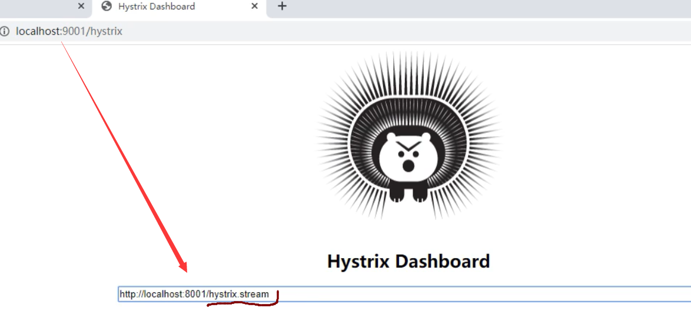


---


# 4. 服务网关


## 一、Zuul

停更ing

---


## 二、Gateway

### Gateway简介

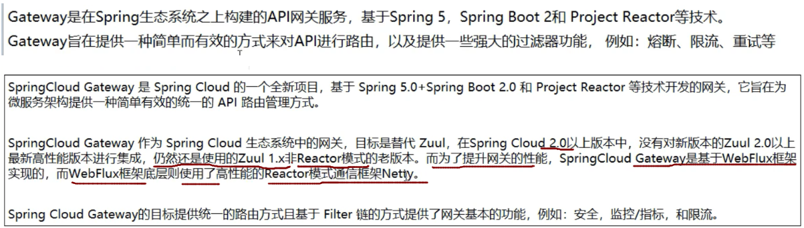

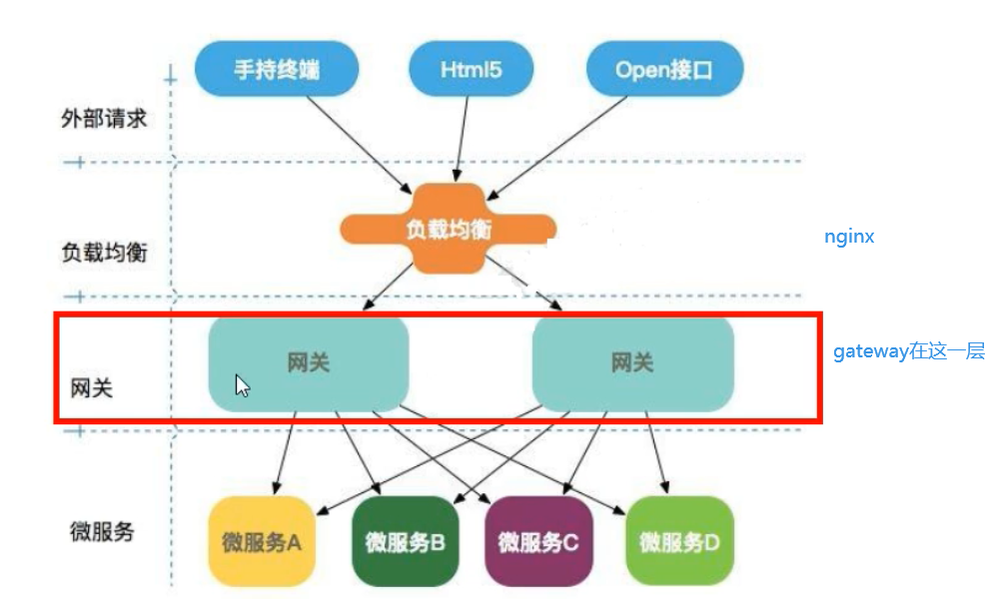


### Gateway的特性	

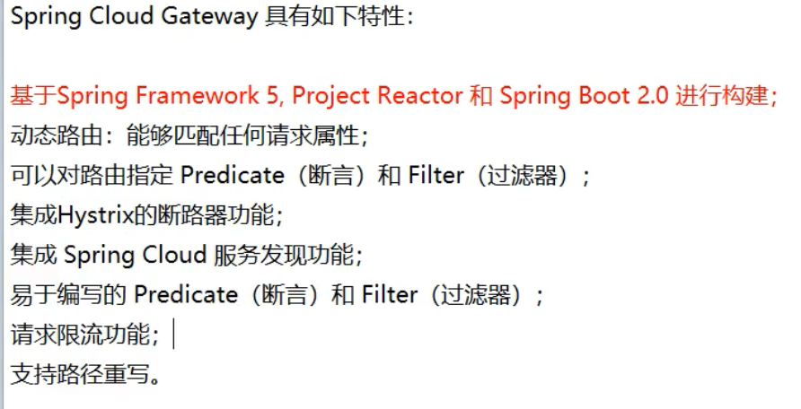


### GateWay与zuul的区别

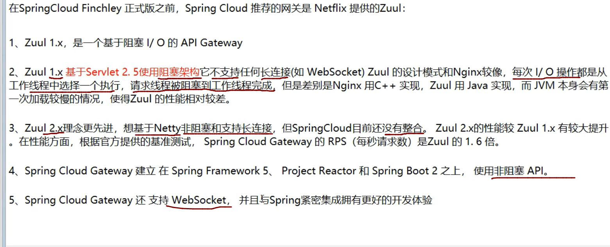


### zuul1.x的模型


### 什么是webflux


### Gateway的相关概念

#### 1. 路由


#### 2. 断言


#### 3. 过滤


### GateWay的工作原理


### 使用Gateway

1. 创建`cloud-gateway-gateway9527`模块

2. 主要依赖：

   ```xml
   <!--gateway-->
   <dependency>
       <groupId>org.springframework.cloud</groupId>
       <artifactId>spring-cloud-starter-gateway</artifactId>
   </dependency>
   ```

3. 配置yml：

   ```yml
   server:
     port: 9527
   
   spring:
     application:
       name: cloud-gateway
     cloud:
       gateway:
         routes:
           - id: payment_route           # 路由的ID，没有固定规则要求唯一
             uri: http://localhost:8001  # 匹配后提供的路由地址
             predicates:
               - Path=/payment/*         # 断言，路径相匹配的进行路由
   
           - id: payment_route2
             uri: http://localhost:8001
             predicates:
               - Path=/payment/lb/**
   ```

4. 启动`cloud-provider-payment8001`、`cloud-eureka-server7001`、`cloud-gateway-gateway9527`

5. 访问`http:localhost:9527/payment/1`  和 `http:localhost:9527/payment/lb`


### 配置动态路由

**为什么要配置动态路由**：当gateway的uri写死以后，如果有服务集群，不能够实现负载均衡

解决方案：gateway配置eureka**注册中心的服务名**，而不是ip地址

1. 修改yml：

   ```yml
   server:
     port: 9527
   
   spring:
     application:
       name: cloud-gateway
     cloud:
       gateway:
         discovery:
           locator:
             enabled: true # 开启从服务注册中心到哪个台创建路由的功能，利用微服务名进行路由
         routes:
           - id: payment_route           # 路由的ID，没有固定规则要求唯一
   #          uri: http://localhost:8001  # 匹配后提供的路由地址
             uri: lb://cloud-payment-service
             predicates:
               - Path=/payment/*         # 断言，路径相匹配的进行路由
   
           - id: payment_route2
   #          uri: http://localhost:8001
             uri: lb://cloud-payment-service
             predicates:
               - Path=/payment/lb/**
   ```

2. 配置以后就能可以使gateway实现动态路由(负载均衡)的能力

3. 访问：`localhost:9527/payment/lb`出现轮询访问


### 断言属性配置


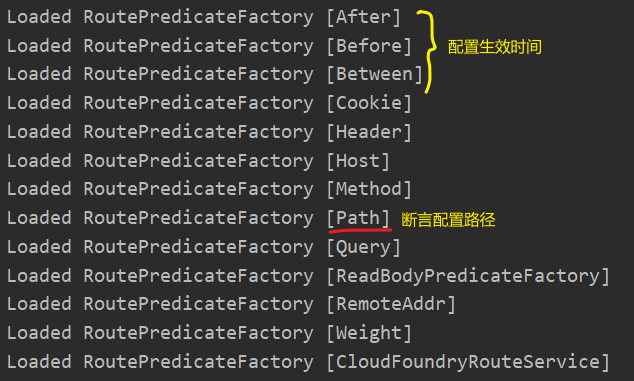

```yml
predicates:
  - Path=/payment/*         # 断言，路径相匹配的进行路由
  - After=2021-01-28T13:46:50.248+08:00[Asia/Shanghai] # 在改时间之后路由才生效
  #- Before=2021-01-28T13:46:50.248+08:00[Asia/Shanghai] # 在改时间之前路由才生效
  # 时间在两者之间路由才生效
  #- Between=2020-01-28T13:46:50.248+08:00[Asia/Shanghai],2021-01-28T13:46:50.248+08:00[Asia/Shanghai]
  #- Cookie=username,zhangsan # 设置Cookie，格式：参数名,正则表达式
  #- Header=x-header,xxx	# 设置请求头
  #- Method=GET # 请求方法
```


### 配置全局过滤

在springcloud包下新建filter包，

创建MyLogGatewayFilter类

```java
@Slf4j
@Component
public class MyLogGatewayFilter implements GlobalFilter, Ordered {

    @Override
    public Mono<Void> filter(ServerWebExchange exchange, GatewayFilterChain chain) {
        log.info("------------ come in MyLogGateWayFilter: " + new Date());
        String username = exchange.getRequest().getQueryParams().getFirst("username");
        if (StringUtils.isEmpty(username)) {
            log.info("------------ 用户名 [{}] 非法 o(╥﹏╥)o", username);
            exchange.getResponse().setStatusCode(HttpStatus.NOT_ACCEPTABLE);
            return exchange.getResponse().setComplete();
        }
        return chain.filter(exchange);
    }

    @Override
    public int getOrder() {
        return 0;
    }
}
```

当访问服务时，需要在路径后添加`username`的参数(如：`localhost:9527/payment/lb?username=zs`)，否则不放行

---


# 5. 服务配置


